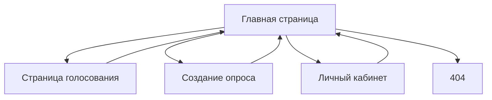
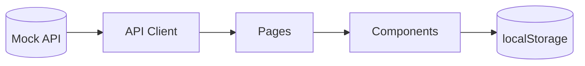

# Архитектура приложения

---

# Общая архитектура

Приложение представляет собой SPA (Single Page Application), построенное на Vanilla JavaScript с клиентским роутингом.

Архитектура разделена на следующие слои:

1. UI-компоненты
2. Pages
3. Router
4. API layer
5. Utils
6. Mock backend
7. LocalStorage layer

---

# Структура приложения

```txt
src/
├── api/
├── components/
├── pages/
├── router/
├── styles/
├── utils/
└── main.js
```

---

# Описание модулей

## Components

Переиспользуемые UI-компоненты:

- Header
- Footer
- PollCard
- PollList
- ResultsChart
- PollDetail
- CreatePoll
- Dashboard

---

## Pages

SPA-страницы:

- HomePage
- PollPage
- CreatePage
- DashboardPage
- NotFoundPage

---

## Router

Отвечает за:

- navigation;
- pushState;
- popstate;
- рендер страниц;
- обработку 404.

---

## API

Слой взаимодействия с backend:

- fetch;
- retry;
- caching;
- loading states;
- error handling.

---

## Utils

Вспомогательные модули:

- validators;
- sanitizer;
- storage;
- helpers.

---

# Структура данных

## Poll

```json
{
  "id": "poll_1",
  "question": "Вопрос",
  "description": "Описание",
  "type": "single",
  "category": "IT",
  "expiresAt": "2026-01-01",
  "createdAt": "2026-01-01",
  "authorId": "user_1",
  "options": []
}
```

---

## Vote

```json
{
  "id": "vote_1",
  "pollId": "poll_1",
  "selectedOptions": [],
  "createdAt": "2026-01-01"
}
```

---

# LocalStorage

## Используемые ключи

| Ключ | Назначение |
|---|---|
| `votes` | Голоса пользователя |
| `createdPolls` | Созданные опросы |

---

# Навигация приложения

## Маршруты

| Route | Страница |
|---|---|
| `/` | Главная |
| `/poll?id=...` | Голосование |
| `/create` | Создание |
| `/dashboard` | Личный кабинет |

---

# Mermaid диаграмма навигации



---

# Поток данных



---

# Особенности архитектуры

## Mobile-first

Интерфейс сначала проектируется для мобильных устройств.

---

## SPA

Навигация осуществляется без полной перезагрузки страницы.

---

## Безопасность

Все данные проходят sanitization перед рендером.

---

## Адаптивность

Поддерживаются разрешения:

- 320px
- 768px
- 1024px

---

# Вывод

Разработанная архитектура обеспечивает:

- масштабируемость;
- модульность;
- читаемость;
- простоту поддержки;
- переиспользуемость компонентов.